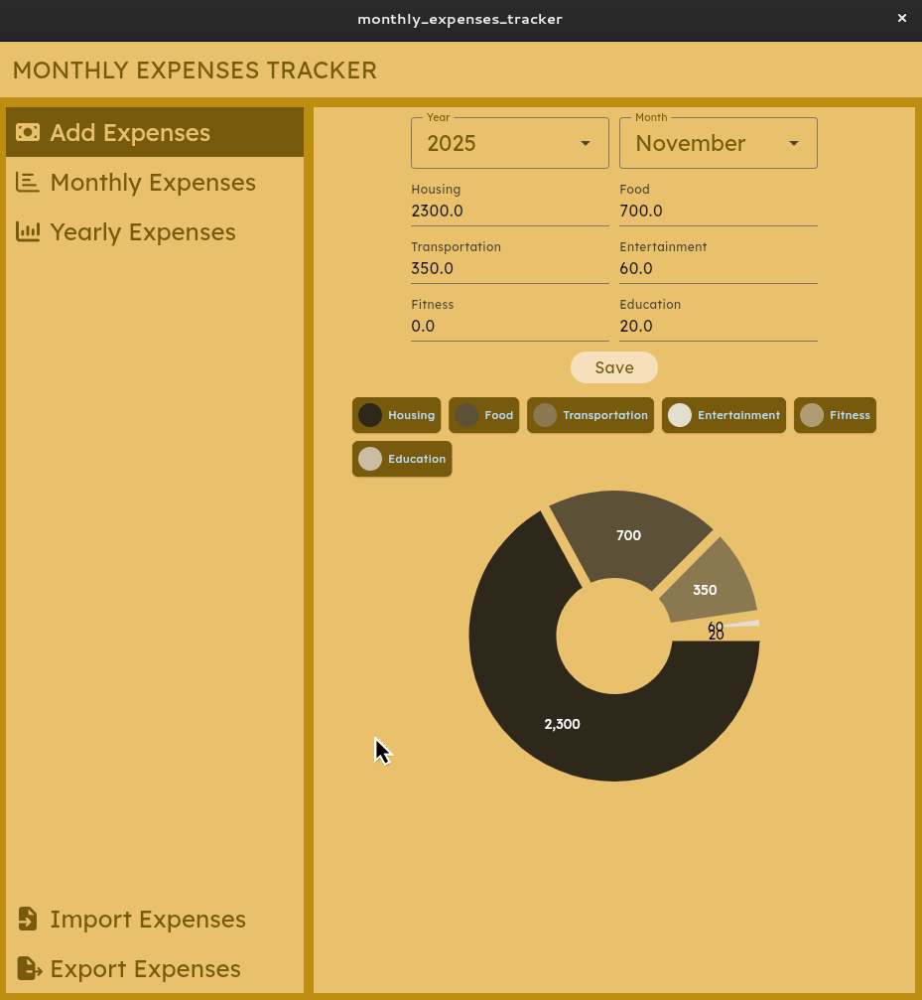

# Monthly Expenses Tracker

A simple open-source expenses tracker.

- **Easy to use:** At the end of the month, simply enter your expenses for the prior month. That's it.
- **6 expense categories:** With only 6 categories to choose from, entering your expenses is quick and easy.
- **Private data storage:** Your data is stored locally within your web browser.
- **Monthly and yearly charts:** Easily view your expenses on a monthly or yearly basis, using the included charts.

## Getting Started

There's no need to sign up!

Simply go to [https://emmanuelrosa.github.io/monthly_expenses_tracker/](https://emmanuelrosa.github.io/monthly_expenses_tracker/).

## Credits

- This app is based on Jacinto's [expense-tracker](https://github.com/JacintoDesign/expense-tracker/) project.
- I used [FontAwesome](https://fontawesome.com/) for some of the icons.
- The main font comes from [Google Fonts](https://fonts.google.com/).
- A lot of the functionality comes from various packages available at [pub.dev](https://pub.dev/).
