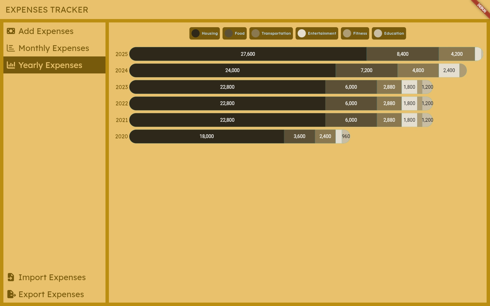
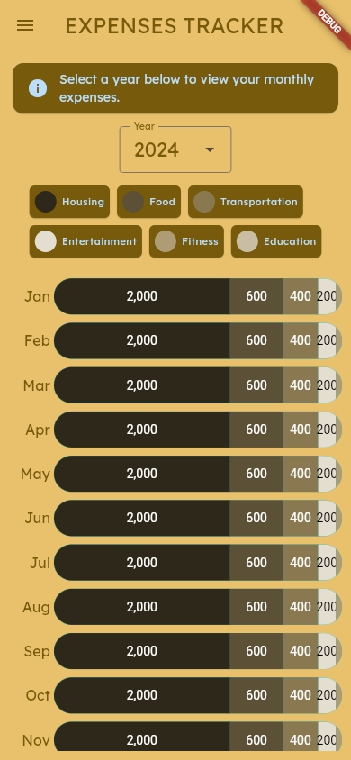
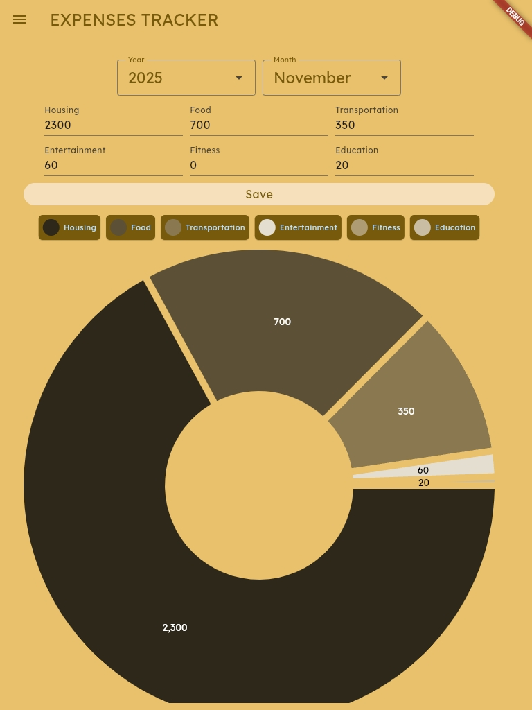

# Monthly Expenses Tracker

A simple open-source expenses tracker.

- **Easy to use:** At the end of the month, enter your expenses for the prior month. That's it.
- **6 expense categories:** With only 6 categories to choose from, entering your expenses is painless.
- **Monthly and yearly charts:** Keep an eye on your expenses so they don't get out of hand, using the included charts.
- **Private data storage:** Your data is stored locally within your web browser. Nothing is shared with anyone.
- **No vendor lock-in:** Import or export your expenses using a CSV file. Great for bulk data entry from Microsoft Excel or LibreOffice, and for backups.

## Getting Started

No sign up required!

Just go to [https://emmanuelrosa.github.io/monthly_expenses_tracker/](https://emmanuelrosa.github.io/monthly_expenses_tracker/).

## Credits

- This app is based on Jacinto's [expense-tracker](https://github.com/JacintoDesign/expense-tracker/) project.
- I used [FontAwesome](https://fontawesome.com/) for some of the icons.
- The main font comes from [Google Fonts](https://fonts.google.com/).
- A lot of the functionality comes from various packages available at [pub.dev](https://pub.dev/).

## Nerdy Notes

### Build Notes

- When building the web release for GitHub pages, you need to specify the base URL with the repository name. Ex: `flutter build web --base-href /monthly_expenses_tracker`
